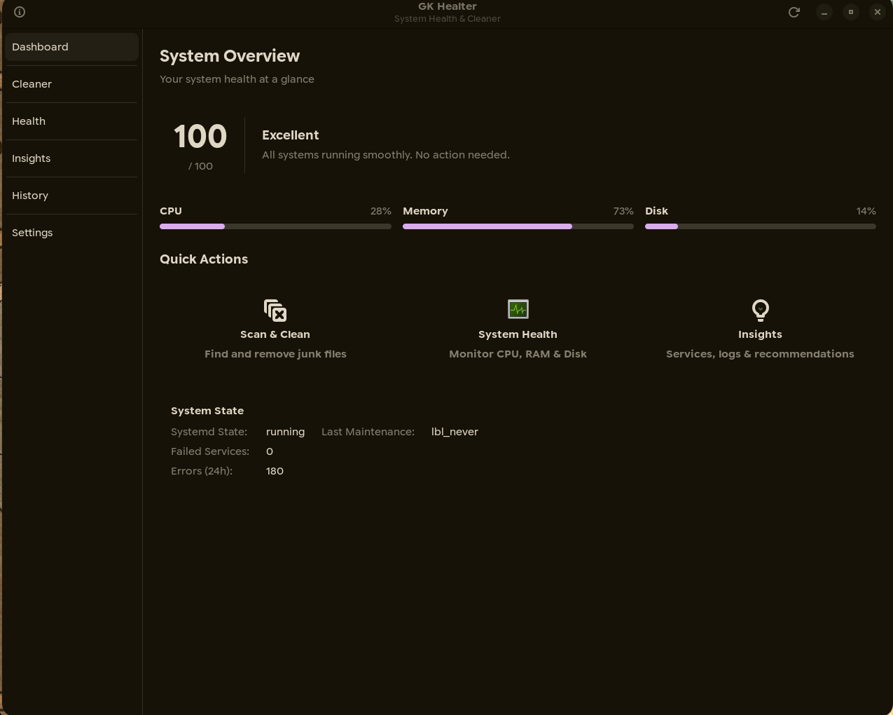

# GK Healter

<div align="center">
  <a href="README.tr.md">🇹🇷 Türkçe</a> &nbsp;|&nbsp; 
  <a href="README.md">🇬🇧 English (İngilizce)</a>
</div>

<center>


</center>


**GK Healter**, Pardus ve Debian tabanlı Linux dağıtımları için tasarlanmış profesyonel bir **sistem bakım, sağlık izleme ve güvenlik denetim** aracıdır. Güvenlik ve verimlilik ön plandadır; kullanıcılara sistem kararlılığını bozmadan disk alanı kazandırma, hata tespiti ve proaktif bakım imkânı sunar.

> 🏆 **TEKNOFEST 2026 — Pardus Hata Yakalama ve Öneri Yarışması** (Geliştirme Kategorisi) için geliştirilmektedir.

**Geliştiriciler:** Egehan KAHRAMAN & Mustafa GÖKPINAR — **GK Developers**

---

## İçindekiler

- [Proje Amacı](#proje-amacı)
- [Pardus'a Özgü Özellikler](#pardusa-özgü-özellikler)
- [Temel Özellikler](#temel-özellikler)
- [Ekran Görüntüsü](#ekran-görüntüsü)
- [Teknik Mimari](#teknik-mimari)
- [Kurulum](#kurulum)
- [Kaynak Koddan Derleme](#kaynak-koddan-derleme)
- [Testler](#testler)
- [Güvenlik Yaklaşımı](#güvenlik-yaklaşımı)
- [Paketleme](#paketleme)
- [Katkıda Bulunma](#katkıda-bulunma)
- [Lisans](#lisans)

---

## Proje Amacı

GK Healter, Pardus kullanıcılarına ve sistem yöneticilerine şu konularda yardımcı olmayı amaçlar:

1. **Sistem hatalarını tespit etme ve düzeltme** — Bozuk paketler, başarısız servisler, journal hataları
2. **Güvenlik açıklarını belirleme** — SUID dosyaları, world-writable izinler, SSH yapılandırma riskleri
3. **Disk alanı yönetimi** — APT önbelleği, eski loglar, tarayıcı önbellekleri, coredump dosyaları
4. **Proaktif bakım önerileri** — Yapay zekâ destekli ve kural tabanlı öneri motoru
5. **Pardus'a özel tanılama** — Pardus depolarını, servislerini ve paketlerini doğrulama
6. **Rapor oluşturma** — Jüri sunumu ve demo amacıyla TXT, HTML ve JSON formatlarında raporlama

---

## Pardus'a Özgü Özellikler

### Pardus Depo Sağlık Kontrolü
- APT kaynakları doğrulama ve sürüm uyumu kontrol
- Pardus depolarının erişilebilirlik testi (ms cinsinden yanıt süresi)
- Bozuk/tutulan paket tespiti (`dpkg --audit`, `apt-get check`)

### Pardus Servis Tanılama
- `pardus-*` ve `eta-*` servislerinin durum kontrolü
- Pardus Yazılım Merkezi servis izleme
- Systemd birim sağlık analizi

### Pardus Doğrulama Modülü
- Sistem kimlik bilgileri toplama (`/etc/os-release`, `lsb_release`)
- Pardus'a özgü paketlerin varlık kontrolü
- Donanım bilgisi (CPU, RAM, kernel, mimari)
- Masaüstü ortamı tespiti
- Jüri sunumu için doğrulama raporu oluşturma

### Sürüm Uyumluluk Kontrolü
- APT sources.list dosyalarının doğru Pardus sürümünü hedefleyip hedeflemediğini kontrol eder
- Yanlış yapılandırılmış depolar için uyarı üretir

---

## Temel Özellikler

### Sistem Bakımı
- **Paket Yönetimi:** APT önbellek temizleme, yetim paket kaldırma, bozuk bağımlılık düzeltme (polkit aracılığıyla)
- **Log Temizliği:** Eski logları silme, systemd journal vakumlama, eski coredump'ları temizleme
- **Uygulama Hijyeni:** Firefox/Chrome önbelleği, küçük resim galerileri, kullanıcıya özel geçici dosyalar
- **Güvenli Silme:** Beyaz liste tabanlı koruma, kritik sistem dosyalarının yanlışlıkla silinmesini önler

### İzleme ve Zekâ
- **Gerçek Zamanlı Sağlık Puanı:** CPU, RAM ve disk kullanımı izleme ile bileşik sağlık puanı (0–100)
- **Hibrit Yapay Zekâ:** Her zaman çevrimdışı çalışan `LocalAnalysisEngine` + isteğe bağlı Gemini, OpenAI ve Claude (Anthropic) API desteği
- **Akıllı Öneriler:** Sistem metriklerine dayalı kural tabanlı öneri motoru
- **Servis Analizi:** Başarısız systemd servislerini ve yavaş başlayan birimleri tespit
- **Log Analizi:** Kritik/hata düzeyindeki journal kayıtlarını önem derecesine göre sınıflandırma

### Güvenlik Denetimi
- **World-Writable Dosya Tespiti:** Güvensiz izinler için sistem dizinlerini tarama
- **SUID/SGID Denetimi:** Bilinen beyaz listeye karşı beklenmeyen set-uid dosyalarını tespit
- **Sudoers Risk Analizi:** Tehlikeli `NOPASSWD: ALL` girişlerini işaretleme
- **SSH Sıkılaştırma Kontrolü:** `sshd_config` güvenlik en iyi uygulamalarına göre doğrulama
- **Otomatik Güncelleme İzleme:** Otomatik güvenlik güncellemelerinin etkin olup olmadığını kontrol
- **Başarısız Giriş Takibi:** Journal'dan kimlik doğrulama başarısızlıklarını özetleme

### Otomasyon
- **Akıllı Otomatik Bakım:** Boşta kalma süresi, disk eşikleri ve güç durumuna göre zamanlanmış temizlik
- **Temizlik Geçmişi:** Tüm işlemlerin tarih, boyut ve sonuç bilgileriyle kapsamlı takibi

### Rapor Dışa Aktarma
- **TXT Rapor:** Yapılandırılmış düz metin formatında sistem raporu
- **HTML Rapor:** Kendi kendine yeten, gömülü CSS ile profesyonel görünümlü rapor
- **JSON Rapor:** Programatik erişim için yapılandırılmış veri formatı
- **System doğrulama verisi** Pardus kimliği, donanım bilgisi ve kurulu paketler

### Kullanıcı Deneyimi
- **Yerel GTK 3 Arayüzü:** Sistem teması ve karanlık moda uyumlu modern tasarım
- **Çoklu Dil Desteği:** Türkçe ve İngilizce — genişletilebilir JSON tabanlı i18n sistemi

---

## Ekran Görüntüsü



---

## Teknik Mimari

```
src/
├── main.py                     # Uygulama giriş noktası
├── ui.py                       # GTK arayüz kontrolcüsü (Builder pattern)
├── cleaner.py                  # Güvenli silme motoru
├── health_engine.py            # Gerçek zamanlı sistem sağlık izleme
├── pardus_analyzer.py          # Pardus/Debian'a özgü tanılama
├── pardus_verifier.py          # Pardus doğrulama ve kimlik toplama
├── security_scanner.py         # Sistem güvenlik denetim motoru
├── report_exporter.py          # TXT / HTML / JSON rapor üretici
├── distro_manager.py           # Çoklu dağıtım paket yönetici soyutlama
├── disk_analyzer.py            # Büyük dosya keşfi
├── log_analyzer.py             # Journal hata analizi
├── service_analyzer.py         # Systemd servis sağlığı
├── recommendation_engine.py    # Kural tabanlı sistem önerileri
├── ai_engine.py                # Hibrit yapay zekâ: yerel analiz + bulut
├── auto_maintenance_manager.py # Zamanlanmış bakım mantığı
├── settings_manager.py         # Kalıcı yapılandırma
├── history_manager.py          # Temizlik geçmişi takibi
├── i18n_manager.py             # Uluslararasılaştırma (JSON tabanlı)
├── logger.py                   # Merkezî günlükleme (dönen dosyalar)
└── utils.py                    # Paylaşılan yardımcı fonksiyonlar
```

### Teknoloji Yığını

| Bileşen | Teknoloji |
|---|---|
| Programlama Dili | [Python 3.9+](https://www.python.org/) |
| Grafik Arayüz | [GTK 3 (PyGObject)](https://pygobject.readthedocs.io/) |
| Derleme Sistemi | [Meson](https://mesonbuild.com/) / GNU Make |
| Test Çatısı | [pytest](https://docs.pytest.org/) — 246+ test, %75+ kapsama |
| Sürekli Entegrasyon | GitHub Actions (flake8, AppStream, çoklu Python sürümü, Codecov) |
| Paketleme | Flatpak, Debian (.deb), Arch (PKGBUILD), RPM (.spec) |
| Yetki Yükseltme | Polkit (pkexec) — 5 özel politika eylemi |

---

## Kurulum

### Pardus / Debian / Ubuntu (.deb) — Önerilen

```bash
cd gk-healter
make deb
sudo dpkg -i gk-healter_0.1.6_all.deb
sudo apt-get install -f  # Eksik bağımlılıkları düzelt
```

### Flatpak (tüm dağıtımlar)

```bash
flatpak install flathub io.github.gkdevelopers.GKHealter
flatpak run io.github.gkdevelopers.GKHealter
```

### Arch Linux (AUR / PKGBUILD)

```bash
cd packaging/arch
makepkg -si
```

### Fedora / openSUSE (RPM)

```bash
rpmbuild -ba packaging/rpm/gk-healter.spec
```

### Genel Kurulum (tüm dağıtımlar)

```bash
cd gk-healter
sudo make install
# Kaldırmak için:
sudo make uninstall
```

---

## Kaynak Koddan Derleme

```bash
git clone https://github.com/GK-Developers/GK-Healter.git
cd GK-Healter/gk-healter

meson setup _build
meson compile -C _build
sudo meson install -C _build
```

### Derleme Bağımlılıkları

| Bağımlılık | Pardus/Debian | Arch | Fedora |
|---|---|---|---|
| Python 3 | `python3` | `python` | `python3` |
| PyGObject | `python3-gi` | `python-gobject` | `python3-gobject` |
| GTK 3 | `gir1.2-gtk-3.0` | `gtk3` | `gtk3` |
| psutil | `python3-psutil` | `python-psutil` | `python3-psutil` |
| Polkit | `policykit-1` | `polkit` | `polkit` |
| Meson | `meson` | `meson` | `meson` |

---

## Testler

```bash
pip install pytest pytest-cov
pytest -v --cov=src --cov-report=term-missing
```

Test altyapısı:
- **246+ test fonksiyonu** — 16 modül üzerinde kapsamlı birim testleri
- **%75+ satır kapsamı** — CI eşiğiyle enforce edilen minimum kapsama
- **Mocked I/O:** Tüm dosya sistemi ve subprocess testleri mock ile izole
- **GitHub Actions CI:** flake8, AppStream doğrulama, çoklu Python sürümü (3.9–3.12)

---

## Güvenlik Yaklaşımı

GK Healter güvenliği birinci öncelik olarak ele alır:

1. **Beyaz Liste Tabanlı Silme:** Yalnızca önceden tanımlanmış güvenli dizinler temizlenebilir
2. **Polkit Entegrasyonu:** Sistem düzeyindeki işlemler için kullanıcı kimlik doğrulaması gerekir
3. **`rm -rf` Yasağı:** Rekürsif zorla silme hiçbir durumda kullanılmaz
4. **Kök Yol Koruması:** `/`, `/home`, `/etc` vb. kritik dizinlere dokunulamaz
5. **Denetim İzi:** Tüm silme işlemleri zaman damgası ve sonuçla birlikte kaydedilir
6. **SUID Beyaz Listesi:** Bilinen güvenli SUID dosyaları `KNOWN_SUID_PATHS` ile filtrelenir
7. **SSH Sıkılaştırma:** `PermitRootLogin`, `PasswordAuthentication` vb. ayarlar kontrol edilir

---

## Paketleme

| Format | Dosya | Konum |
|---|---|---|
| Flatpak | `flathub_submission.yml` | `gk-healter/` |
| Arch Linux | `PKGBUILD` | `gk-healter/packaging/arch/` |
| RPM | `gk-healter.spec` | `gk-healter/packaging/rpm/` |
| Debian/Pardus | `debian/control` | `gk-healter/debian/` |

---

## Katkıda Bulunma

Geliştirme kurulumu ve katkı kuralları için [CONTRIBUTING.md](CONTRIBUTING.md) dosyasına bakınız.

---

## Lisans

Bu proje **MIT Lisansı** altında lisanslanmıştır. Ayrıntılar için [LICENSE](LICENSE) dosyasına bakınız.

---

## Proje Bağlantıları

- **Ana Sayfa:** [https://github.com/GK-Developers/GK-Healter](https://github.com/GK-Developers/GK-Healter)
- **Hata Takip:** [https://github.com/GK-Developers/GK-Healter/issues](https://github.com/GK-Developers/GK-Healter/issues)
- **Kaynak Kod:** [https://github.com/GK-Developers/GK-Healter](https://github.com/GK-Developers/GK-Healter)
